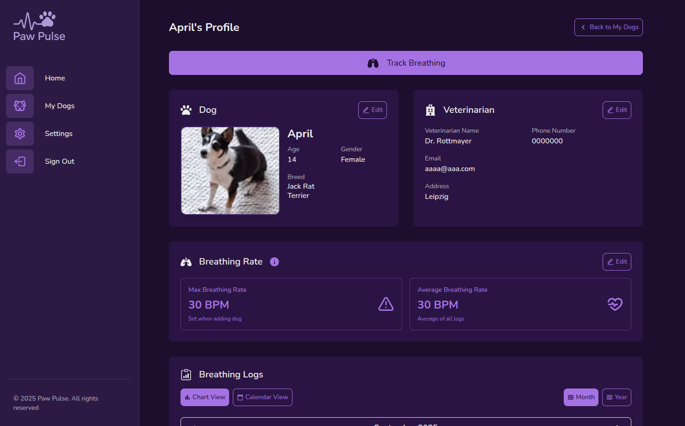
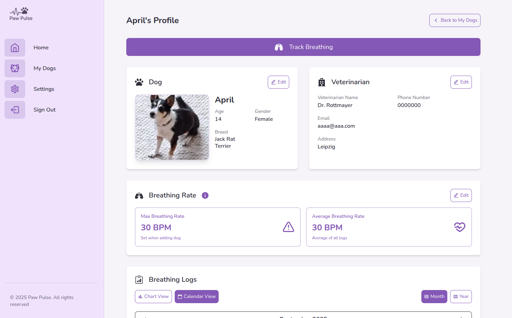
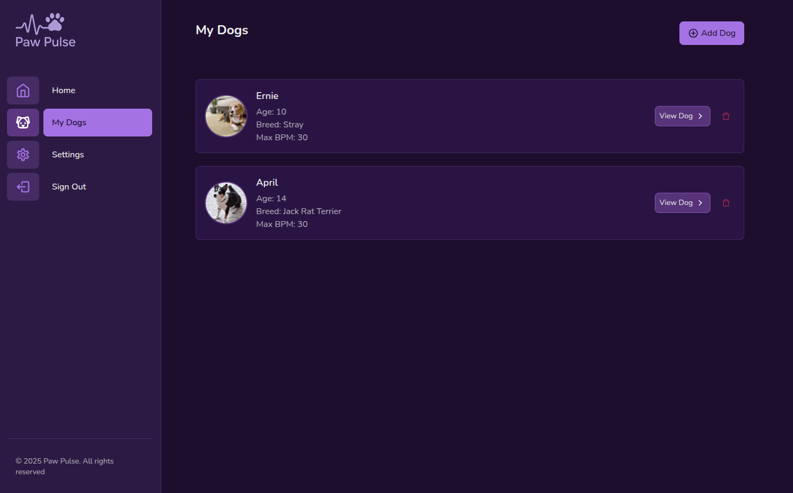
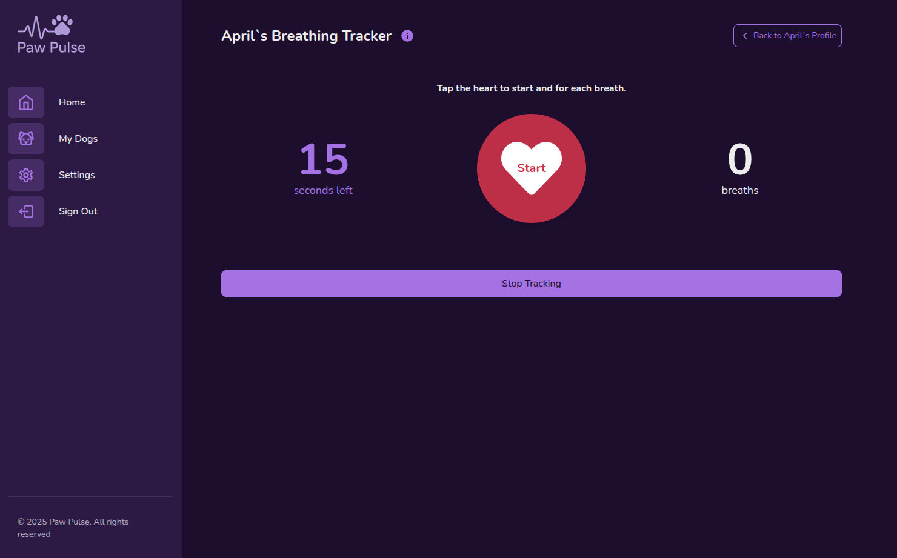
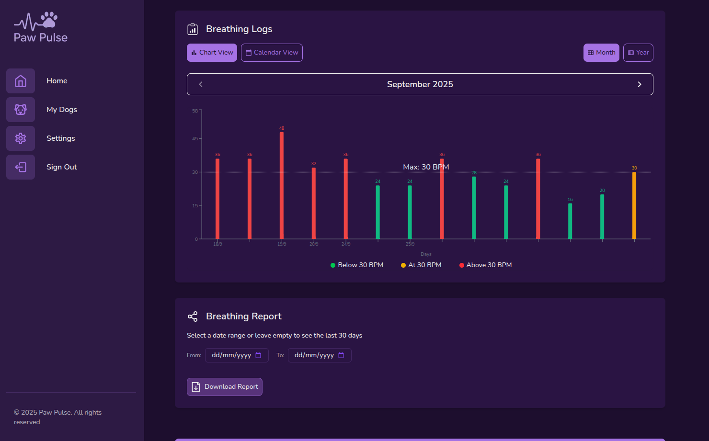
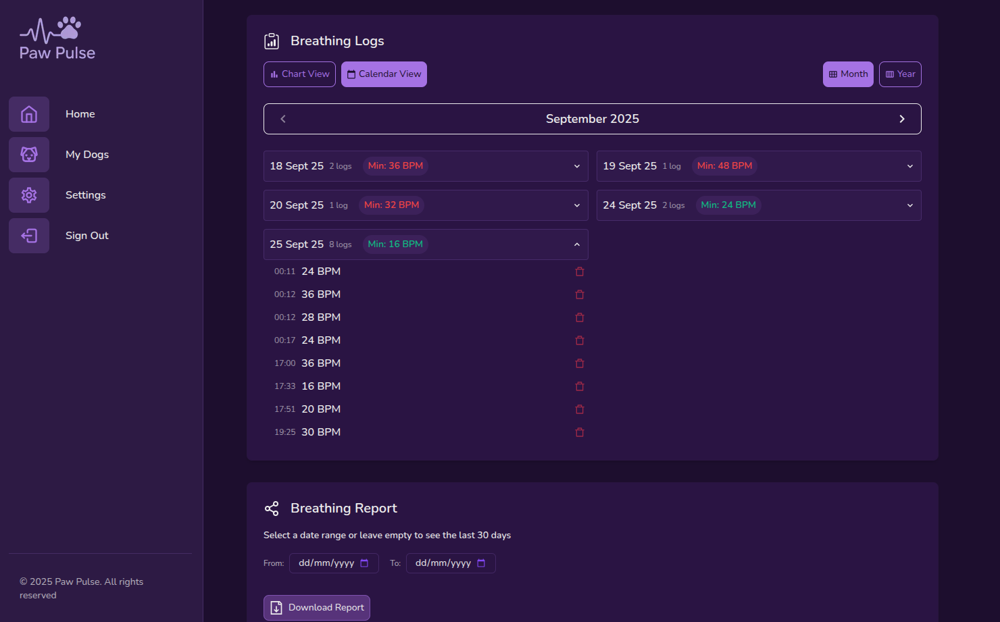

# Dog Breath Counter

A full-stack web application to track dog breathing rates, built with **TypeScript**, **Next.js**, and **Express**. **CI/CD** is implemented using **GitHub Actions**, with automated tests using **Vitest**.

When a dog has or is at risk of developing a heart condition, monitoring their resting respiratory rate can be crucial. This app helps dog owners track their dog's breathing over time, detect early signs of heart disease, and share data with their veterinarian, ultimately helping to prevent the condition from worsening.

I’ve been using **[My Pet´s Heart2Heart app](https://apps.apple.com/de/app/my-pet-s-heart2heart/id1564965551)** from **Boehringer Ingelheim** for the past year to help care for my dog, April, who has a heart condition. Inspired by that experience, I create PawPulse as a tool that offers the same core functionality with a few twists that make daily tracking and sharing data with a veterinarian even easier.

## Table of Contents

- [App Overview](#app-overview)
- [Tech Stack](#tech-stack-monorepo)
- [Features](#features)
- [User Stories](#user-stories)
- [Project Structure](#project-structure)
- [RESTful API Design](#restful-api-design)
- [Getting Started](#getting-started)
- [Available Scripts](#available-scripts)
- [Development Notes](#development-notes)
- [Testing Strategy](#testing-strategy)
- [CI/CD Pipeline](#ci-/-cd-pipeline)
- [To Dos](#to-dos)
- [Author](#author)

## App Overview

#### LIVE DEMO [HERE](https://pawpulse-breathcounter.vercel.app/)


| Dark mode                                                | Light mode                                                |
| -------------------------------------------------------- | --------------------------------------------------------- |
|  |  |

| My Dogs Page                                                | Track Breathing Page                                           |
| ----------------------------------------------------------- | -------------------------------------------------------------- |
|  |  |

| Breathing Logs (Chart View)                                           | Breathing Logs (Calendar View)                                           |
| --------------------------------------------------------------------- | ------------------------------------------------------------------------ |
|  |  |

## Tech Stack (Monorepo)

### Frontend

- **Framework**: Next.js 15.3
- **Library**: React 19
- **Language**: TypeScript
- **Styling**: Tailwind CSS
- **Data/HTTP**: Axios
- **State**: Context API + reducers
- **Authentication**: Google OAuth
- **Charts**: Recharts
- **Icons**: React Icons
- **Notifications**: React Toastify
- **Image Upload**: Cloudinary + Next Cloudinary

### Backend

- **Runtime**: Node.js
- **Framework**: Express
- **Language**: TypeScript
- **Database**: MongoDB + Mongoose ODM
- **Authentication**: JWT (jsonwebtoken) + Google Auth Library + Bcrypt (password hashing) + Cookie-parser
- **Security**: CORS
- **Environment**: dotenv
- **Image Upload**: Cloudinary
- **PDF Generation**: html-pdf-node
- **Email**: Nodemailer

### Testing

- **Runner**: Vitest
- **Mocking**: vi (Vitest's built-in mock)
- **Database Testing**: mongodb-memory-server

### Development Tools

- **Package & Monorepo**: npm Workspaces
- **Dev Servers**: nodemon (backend) + Next.js dev server (frontend)
- **Script Orchestration**: concurrently
- **Local Checks**: TypeScript + ESLint

### DevOps

- **CI/CD**: GitHub Actions
- **Version Control**: Git
- **Code Quality (CI Gates)**: TypeScript strict mode, ESLint configuration & Automated testing

## Features

- Manual breath counter with real-time breaths per minute (BPM) calculation
- Dog profile management with photos, vital info, and veterinarian contacts
- Breathing history tracking with graph and calendar views
- Data sharing via PDF download (email report feature only works in development due to the 10-second time limit in Vercel's free tier when in production; for this reason, it has been commented out, but all functionality remains in code)
- Secure authentication with Google OAuth and JWT session management
- Responsive UI with dark mode and PWA support for mobile use

## User Stories

#### General & Onboarding

- As a user, I want to scroll through the homepage and see the app's purpose and learn more about breathing rate monitoring.
- As a user, I want to be able to create an account and login.
- As a user, I want to be redirected to **My Dogs** page after logging in.
- As a user, I am redirected to a **Not Found** page when I try to access a page that does not exist.

#### My Dogs Page --> Add Dog Page

- As a user, I want to view my dog(s) on the **My Dogs** page.
- As a user, I want to click the "+ Add Dog" button to add a new dog and be redirected to the **Add Dog** page.
- As a user, I want to fill in the following dog data and save it:
  - Photo
  - Name
  - Breed
  - Age
  - Gender
  - Veterinarian's details (name, clinic name, phone number, email, address)
  - Maximum breathing rate (default is 30 BPM)
- After saving, I am redirected back to the **My Dogs** page.

#### My Dogs Page --> Dog Profile Page

- As a user, I want to click on a dog card on **My Dogs** page and be redirected to its **Dog Profile** page.
- As a user, I want to see the following information in the **Dog Profile** page:
  - **Dog Info**:
    - name
    - age
    - breed
    - photo
  - **Resting respiratory rate**:
    - Maximum breath rate, eg 30 BPM (set when adding dog under **Add Dog** page)
    - Average breath rate, eg 28 BPM (average of all the breaths logged by the user)
  - **Veterinarian**:
    - If added, show the vet info
    - If not, show a "Add" button to add vet info (redirects to **Edit Dog** page)
  - **Share data**:
    - Select a date range
    - Download PDF
    - Share via email (only available in development due to time limit on Vercel's free tier)
  - **Breathing Logs**:
    - Graph of breathing rate history
    - List of logs (date, BPM, comments, delete button per log)

#### Dog Profile Page --> Breathing Monitor Page

- As a user, I want to click the 'Track Breathing' button at the top/bottom of the **Dog Profile** page to go to the **Breathing Monitor** page.
- As a user, I want to select a duration for measurement on the **Breathing Monitor** page: 15 Seconds, 30 Seconds, 60 Seconds.
- As a user, I want to manually tap a heart icon to log a breath in the **Breathing Monitor** page:
  - Seconds decrease as user taps
  - Breath count increases with each tap
- As a user, and once the measurement is done, I can view a modal showing:
  - Breath Count
  - Comment field
  - Confirm: saves log and closes modal
  - Cancel: discards log and closes modal
- As a user, I can stop the breathing tracking by clicking on the button Stop Tracking in the **Breathing Monitor** page and return to the duration selection.

## Project Structure

pet-breath-counter-typescript/  
├── **.github**/ # GitHub configurations  
│ ├── workflows/  
│ │ ├── node.js.yml # CI pipeline for building and testing client/ and server/ using Node.js  
├── **client**/ # Next.js frontend  
│ ├── src/  
│ │ ├── app/ # Next.js app router  
│ │ │ ├── globals.css # Global styles  
│ │ │ ├── layout.tsx # Root layout  
│ │ │ └── page.tsx # Home page  
│ │ └── components/ # React components  
│ ├── .env.example # Client environment variables example  
│ ├── .gitignore # Git ignore rules  
│ ├── next.config.msj / # Next.js configuration  
│ ├── public/ # Static assets  
│ ├── postcss.config.js # PostCSS configuration  
│ ├── tailwind.config.js # Tailwind configuration  
│ └── tsconfig.json # TypeScript configuration  
│ └── vercel.json # Vercel configuration (rewrites API requests to Render backend)  
├── **server**/ # Express backend  
│ ├── src/  
│ │ ├── config/ # Configuration  
│ │ │ ├── tests/ # Configuration tests  
│ │ ├── controllers/ # Route controllers  
│ │ │ ├── tests/ # Controller tests  
│ │ ├── middleware/ # Middleware  
│ │ │ ├── tests/ # Middleware tests  
│ │ ├── models/ # MongoDB models  
│ │ │ ├── tests/ # Model tests  
│ │ ├── routes/ # API routes  
│ │ │ ├── tests/ # Route tests  
│ │ ├── services/ # External services  
│ │ ├── types/ # TypeScript types  
│ │ ├── utils/ # Helper functions  
│ │ └── index.ts # Entry point  
│ ├── .env.example # Server environment variables example  
│ ├── package-lock.json # Dependency lock file  
│ ├── package.json # Server package configuration  
│ ├── tsconfig.json # TypeScript configuration  
│ └── vitest.config.ts # Vitest configuration  
├── .gitignore # Git ignore rules  
├── package-lock.json # Dependency lock file  
├── package.json # Root workspace configuration  
└── README.md # Project documentation

## RESTful API Design

#### Authentication endpoints (`/api/auth`)

| Method | Endpoint                 | Description                                               | Logged in User? |
| ------ | ------------------------ | --------------------------------------------------------- | --------------- |
| POST   | `/register`              | Register a new user                                       | ❌ No           |
| POST   | `/login`                 | Log in and return JWT token                               | ❌ No           |
| POST   | `/login/google`          | Log in or register with Google OAuth                      | ❌ No           |
| GET    | `/logout`                | Log out user (server must clear the cookie)               | ✅ Yes          |
| \*POST | `/forgot-password`       | Send reset link to user's email (token is generated here) | ❌ No           |
| \*POST | `/reset-password/:token` | Reset password using token (token proves user identity)   | ❌ No           |

\* Not implemented

#### User management endpoints (`/api/user`)

| Method  | Endpoint | Description                                 | Logged in User? |
| ------- | -------- | ------------------------------------------- | --------------- |
| GET     | `/me`    | Get current user profile                    | ✅ Yes          |
| DELETE  | `/me`    | Delete user account and all related data    | ✅ Yes          |
| \*PATCH | `/me`    | Update user details (name, email, password) | ✅ Yes          |

\* Only name and email update implemented

#### Dog management endpoints (`api/dogs`)

| Method | Endpoint | Description                         | Logged in User? |
| ------ | -------- | ----------------------------------- | --------------- |
| GET    | `/`      | Get all dogs for the logged-in user | ✅ Yes          |
| POST   | `/`      | Add a new dog                       | ✅ Yes          |
| GET    | `/:id`   | Get a specific dog profile          | ✅ Yes          |
| PATCH  | `/:id`   | Update an existing dog profile      | ✅ Yes          |
| DELETE | `/:id`   | Delete a dog                        | ✅ Yes          |

#### Breathing log management endpoints (`api/dogs/:dogId/breathing-logs`)

| Method | Endpoint        | Description                                                             | Logged in User? |
| ------ | --------------- | ----------------------------------------------------------------------- | --------------- |
| POST   | `/`             | Add a new breathing log to a dog                                        | ✅ Yes          |
| GET    | `/`             | Get all breathing logs for a specific dog (supports date range filters) | ✅ Yes          |
| GET    | `/:logId`       | Get a specific breathing log by its ID                                  | ✅ Yes          |
| DELETE | `/:logId`       | Delete a specific breathing log by its ID                               | ✅ Yes          |
| POST   | `/generate-pdf` | Generate a pdf with all breathing logs within a date range              | ✅ Yes          |
| POST   | `/send-email`   | Email pdf with all breathing logs                                       | ✅ Yes          |

## Getting Started

1. Clone the repository

   ```bash
   git clone git@github.com:diecatiamonteiro/dog-breath-counter-TypeScript.git
   ```

2. From the root directory, install dependencies

   ```bash
   npm install
   ```

3. Create `.env` files for client and for server

4. From the root directory, run the development servers (one single command for both client and server)

   ```bash
   npm run dev
   ```

   This will start:

   - Frontend on http://localhost:3000
   - Backend on http://localhost:5000

## Available Scripts

- Run both client and server from root/: `npm run dev`
- Run client only: `npm run client`
- Run server only: `npm run server`
- Run tests from server/: `npm run test`
- Run lint from client/: `npm run lint`

## Development Notes

### Current Setup

- Monorepo structure using npm workspaces
- TypeScript configuration for both client and server
- TailwindCSS setup with dark mode support
- Basic Express server configuration
- Environment configuration

## Testing Strategy

- **Backend**: Unit tests with Vitest
- **Frontend**: To be implemented
- **E2E**: To be implemented (possibly Cypress)
- **CI**: All tests run on pull requests via GitHub Actions

## CI/CD Pipeline

- **Server side unit tests**: Run on every push and PR
- **Build process**: Both client and server are built in CI (Node 18, 20, and 22)

## TO DOs

- [x] Implement error handling
- [x] Set up MongoDB connection
- [x] Set up testing environment
- [x] Create API documentation
- [x] Create models
- [x] Implement routing
- [x] Create checkToken middleware
- [x] Test checkToken middleware
- [x] Code controllers
- [x] Test controllers
- [x] Implement Cloudinary
- [x] Configure CI/CD pipeline
- [x] Create context & reducers
- [x] Set up axios config file in src/lib/ for api calls
- [x] Create functions for api calls (user, dog, breathing log)
- [x] Set up React Routing
- [x] Set up layout
- [x] Implement auth in FE
- [x] Implement /my-dogs page
- [x] Implement /my-dogs/add-dog form page
- [x] Implement /my-dogs/id/monitor-breathing page
- [x] Implement edit dog data
- [x] Implement basic /my-dogs/id profile page (with no data yet)
- [x] Implement /my-dogs/id page with monitoring data, graphs and share options
- [x] Implement add dog photo via Cloudinary
- [x] Create homepage
- [x] Implement user dashboard
- [x] Check and fix UI and UX of all page
- [x] Improve responsiveness of all page
- [x] Improve accessibility of all repo
- [x] Improve documentation across repo
- [x] Fix errors & warnings from console
- [x] Add InfoDialog
- [x] Test with Lighthouse for performance and accessibility for mobile and desktop
- [x] Fix bugs in generate & send report features
- [ ] Integrate Parlant
- [ ] Integration tests (Cypress)

## Author

Built with ❤️ by [Cátia Monteiro](https://github.com/diecatiamonteiro).

&

Inspired by Boehringer Ingelheim’s [My Pet´s Heart2Heart app](https://apps.apple.com/de/app/my-pet-s-heart2heart/id1564965551), which I’ve been using daily for the past year.
